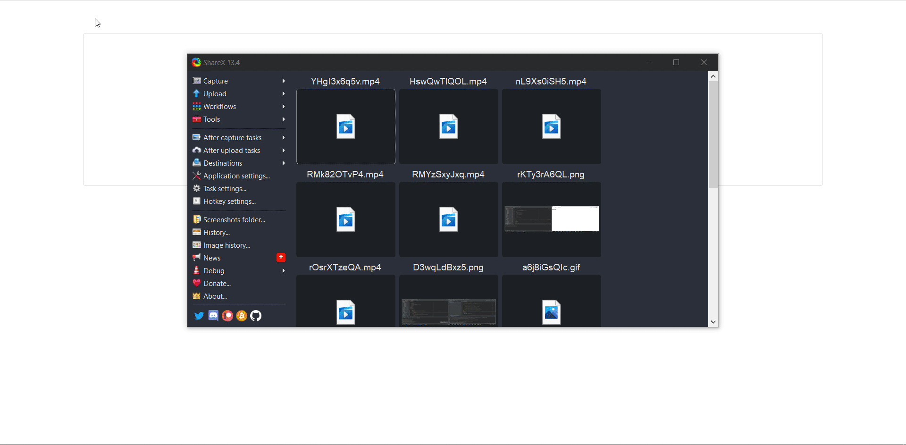

# Expert Assist ~ Data Science project

Idea:

An application where user can upload a csv file and can do visualization of the data from the file

Input1 = file  
Input2 = what  visualization you want to show!?

Chart JS: https://www.chartjs.org/

YouTube video: https://www.youtube.com/watch?v=Y7OAk7DiLJs

